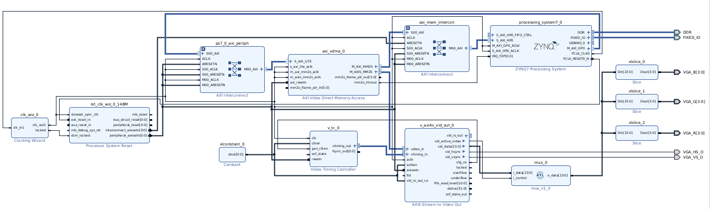

# Video Interface using Zynq and VGA

## Project Overview

This project implements a video output system using the **Zybo Z7-10 FPGA board** and the **Digilent VGA Pmod** to display images on a VGA-compatible monitor. The design uses **Vivado's IP Integrator** to build the block diagram and **Vitis** to write C code that manages memory and frame buffers.

The system centers around the **AXI Video Direct Memory Access (VDMA)** core, which transfers pixel data from DDR memory to the VGA output pipeline. It interfaces with the **Zynq-7000 Processing System (PS)** via AXI memory-mapped and AXI-stream interfaces, utilizing DDR as the frame buffer storage.

A **Video Timing Controller (VTC)** generates VGA-compatible timing signals, including horizontal sync (HS) and vertical sync (VS), which are required by the VGA monitor. These timing signals are fed to the **AXI4-Stream to Video Out** module that handles pixel stream output and sync signal formatting.

The **Clocking Wizard** generates the required pixel clock frequency (125 MHz to 148.5 MHz), and a **Processor System Reset** module ensures proper initialization of all AXI peripherals. Color channel slicing is performed using three `xilslice` blocks to separate red, green, and blue data from the 24-bit AXI video stream.

This project is a gateway to more advanced image processing and video applications such as computer vision, video games, or real-time filtering on FPGAs, using both the Processing System (PS) and Programmable Logic (PL) available on the Zybo Z7 platform.

## Hardware
- Zybo Z7-10 FPGA Board
- Digilent VGA Pmod
- VGA-compatible Monitor
- USB programming cable
- HDMI-to-VGA adapter (if needed)
- Vivado 2022.1 or later
- Vitis 2022.1 or later

## Task List

1. Display an initial image  
2. Add VDMA IP block  
3. Test VDMA  
4. Display images using the VDMA  

## Preliminary Testing

## Block Diagram
### Figure 1. Block Diagram

This diagram illustrates the full hardware design built using Vivado's IP Integrator. At the center is the AXI VDMA block, which fetches image data from DDR memory and streams it to the VGA output via the AXI4-Stream interface. The Video Timing Controller generates the necessary VGA sync signals, while the AXI interconnect ensures proper communication between the Zynq Processing System and the peripheral blocks.

## Displaying an Image

### Displaying a random Image

### Diplaying lena

### Notes:
- This project does not require any additional submodules.  For example, Digilents Pmod library is included in this repo but is not needed.  
- For some unknown reason, the XDC file's code doesn't show up in hardware/constraints folder and it appears empty.  Therefore, use the XDC file that appears in the file tree for this project. 