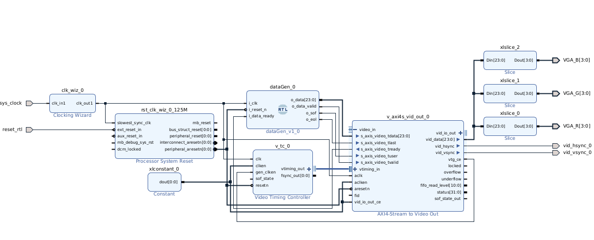
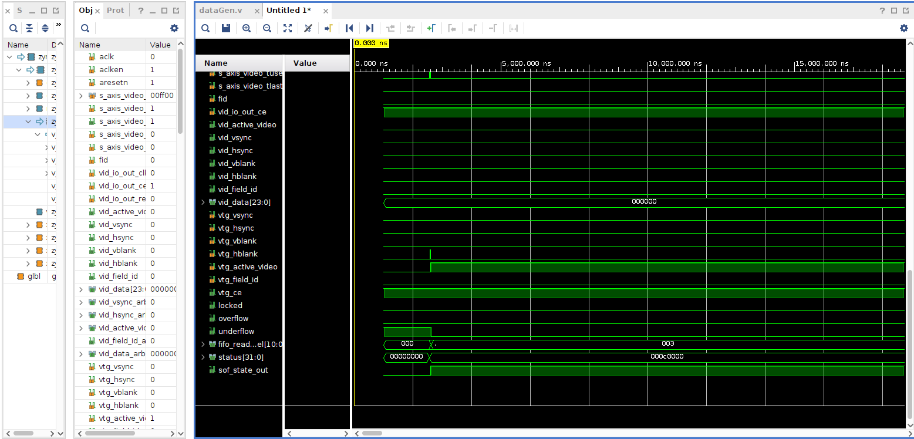
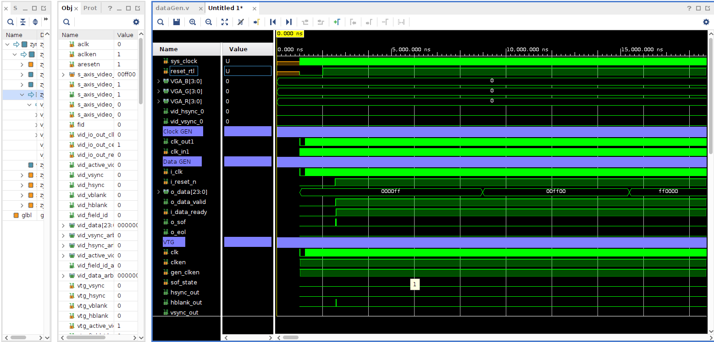
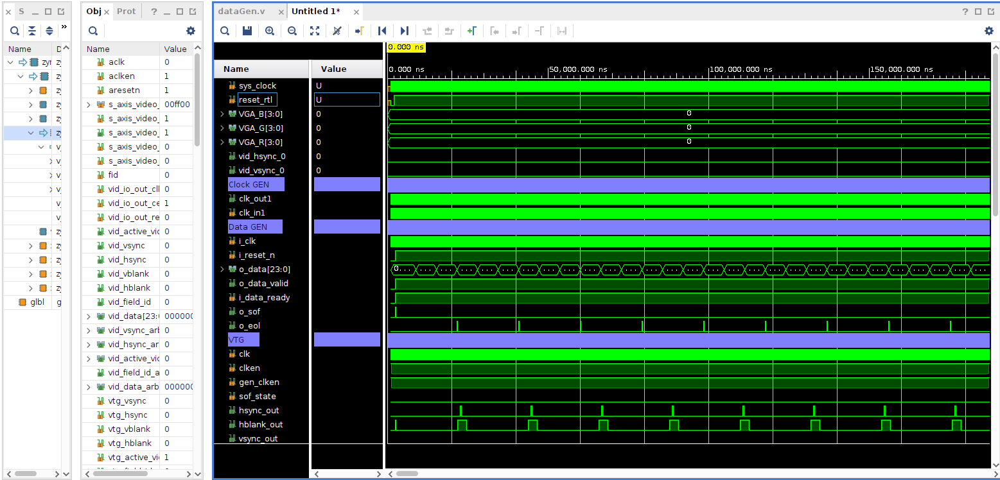
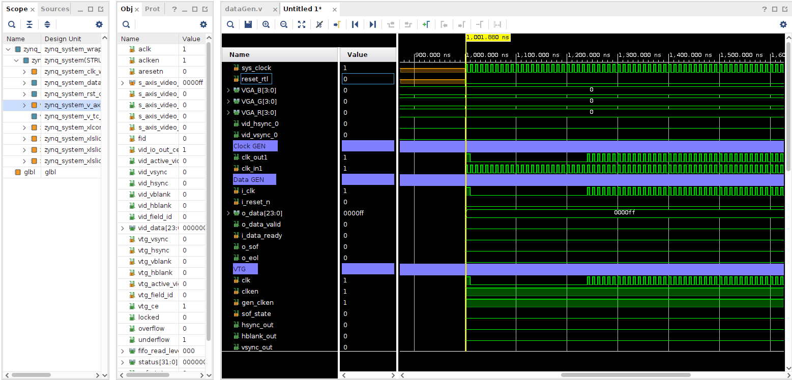
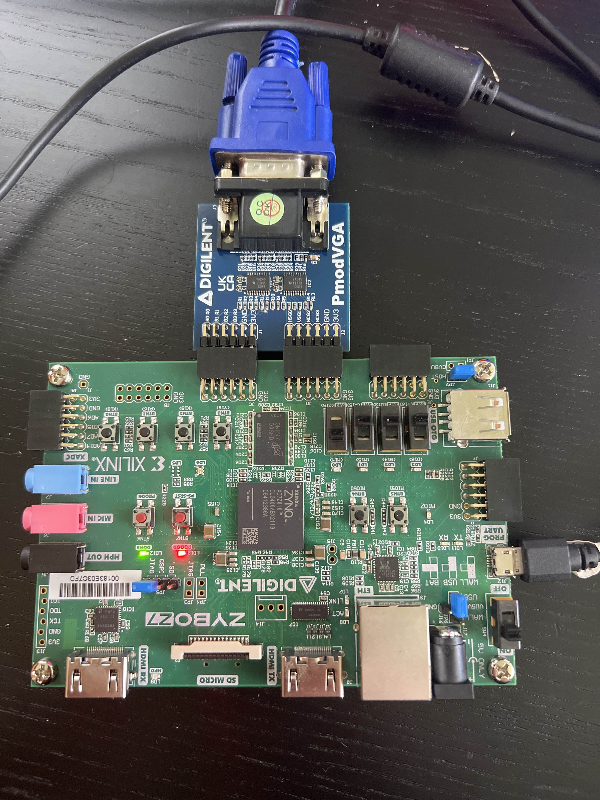
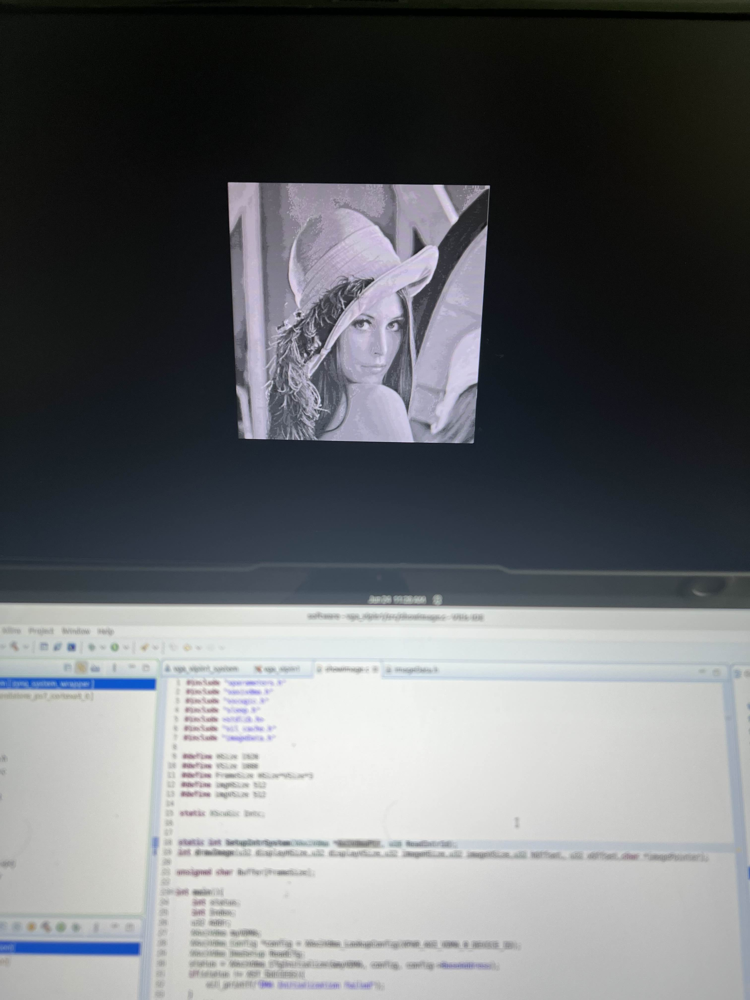

# Video Interface using Zynq and VGA

## Project Overview

This project implements a video output system using the **Zybo Z7-10 FPGA board** and the **Digilent VGA Pmod** to display images on a VGA-compatible monitor. The design uses **Vivado's IP Integrator** to build the block diagram and **Vitis** to write C code that manages memory and frame buffers.

The system centers around the **AXI Video Direct Memory Access (VDMA)** core, which transfers pixel data from DDR memory to the VGA output pipeline. It interfaces with the **Zynq-7000 Processing System (PS)** via AXI memory-mapped and AXI-stream interfaces, utilizing DDR as the frame buffer storage.

A **Video Timing Controller (VTC)** generates VGA-compatible timing signals, including horizontal sync (HS) and vertical sync (VS), which are required by the VGA monitor. These timing signals are fed to the **AXI4-Stream to Video Out** module that handles pixel stream output and sync signal formatting.

The **Clocking Wizard** generates the required pixel clock frequency (125 MHz to 148.5 MHz), and a **Processor System Reset** module ensures proper initialization of all AXI peripherals. Color channel slicing is performed using three `xilslice` blocks to separate red, green, and blue data from the 24-bit AXI video stream.

This project is a gateway to more advanced image processing and video applications such as computer vision, video games, or real-time filtering on FPGAs, using both the Processing System (PS) and Programmable Logic (PL) available on the Zybo Z7 platform.

## Hardware
- Zybo Z7-10 FPGA Board
- Digilent VGA Pmod
- VGA-compatible Monitor
- USB programming cable
- HDMI-to-VGA adapter (if needed)
- Vivado 2022.1 or later
- Vitis 2022.1 or later

## Task List

1. Generating output
2. Adding VDMA IP block  
3. Testing the VDMA  
4. Displaying another image 

## Task 1: Generating output
Before generating an image, I first needed to verify that output data from the FPGA could be transmitted over the VGA pmod.  To do this I created an initial block design without the Video Direct Memory Access (VDMA) and without the Zynq processor.  This involved creating a clock frequency (via clock wizard) that would synchoronize all blocks to common clock.  The frequency chosen was 148.5 MHz.  Since I was not using a Zynq processor, I needed a way to generate data.  The data was generated from a RTL verilog file call dataGen.v which essentially configured an FSM based the logic for VGA using three states: IDLE, SEND_DATA, END_LINE.  These three states describe how data set over VGA would function.  The image below shows the very first block diagram.

### Preliminary Testing

The images below show the various testing the Data Gen verilog file, the VGA, and the timing of the design.

### Displaying  an Image

After testing the VGA within Vivado's simulators, I then moved into Vitis to setup a software program that would generate a simple RGB image.  The image above shows a 3 colors being displayed on a monitor via the VGA pmod.  

## Task 2: Adding VDMA IP block 
### Final Block Diagram

This diagram illustrates the full hardware design built using Vivado's IP Integrator. At the center is the AXI VDMA block, which fetches image data from DDR memory and streams it to the VGA output via the AXI4-Stream interface. The Video Timing Controller generates the necessary VGA sync signals, while the AXI interconnect ensures proper communication between the Zynq Processing System and the peripheral blocks.  Additionally, the Zynq processor needs to be set to 125 MHz as that is the clock frequency of the Zybo Z7-10.  The Zynq processor is then feed directly to the clock wizard block which then converts it to 148.5 MHz.  A clock wizard is needed because the Zynq cannot generate the correct frequency by itself due to clock skew.  

This image here shows the physical setup of the Zybo board with the VGA pmod for all tasks.  

## Task 3: Testing the VDMA

Before additional images could be viewed, I created a header file (imageData.h) and another C file (showImage.c) that would display and store images.  I created images by converting them into a character array that stored the image's intensity values.  The character array would then be passed into functions in the C file and then displayed on the monitor.  

## Task 4: Displaying another image 

The first image shows the image that I planned to load and display into my FPGA.  I converted the lena image into a grayscaled image and then collected all the pixel values into a character array.  Again those values were passed into the showImage.c file and then displayed on my monitor.  

### Notes:
- This project does not require any additional submodules.  For example, Digilents Pmod library is included in this repo but is not needed.  
- For some unknown reason, the XDC file's code doesn't show up in hardware/constraints folder and it appears empty.  Therefore, use the XDC file that appears in the file tree for this project. 